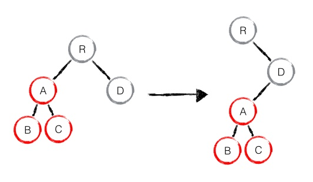

[[TOC]]

[TOC]


# react的diff算法和性能优化

React 中最值得称道的部分莫过于 Virtual DOM 与 diff 的完美结合，特别是其高效的 diff 算法，让用户可以无需顾忌性能问题而”任性自由”的刷新页面，让开发者也可以无需关心 Virtual DOM 背后的运作原理，因为 React diff 会帮助我们计算出 Virtual DOM 中真正变化的部分，并只针对该部分进行实际 DOM 操作，而非重新渲染整个页面，从而保证了每次操作更新后页面的高效渲染，因此 Virtual DOM 与 diff 是保证 React 性能口碑的幕后推手。


## 1. 传统的diff算法

计算一棵树形结构转换成另一棵树形结构的最少操作，是一个复杂且值得研究的问题。[传统 diff 算法](https://link.zhihu.com/?target=http%3A//grfia.dlsi.ua.es/ml/algorithms/references/editsurvey_bille.pdf)通过循环递归对节点进行依次对比，效率低下，算法复杂度达到 O(n^3)，其中 n 是树中节点的总数。O(n^3) 到底有多可怕，这意味着如果要展示1000个节点，就要依次执行上十亿次的比较。这种指数型的性能消耗对于前端渲染场景来说代价太高了！现今的 CPU 每秒钟能执行大约30亿条指令，即便是最高效的实现，也不可能在一秒内计算出差异情况。

## 2. react diff策略


传统 diff 算法的复杂度为 O(n^3)，显然这是无法满足性能要求的。**React 通过三大策略，将 O(n^3) 复杂度的问题转换成 O(n) 复杂度的问题**。

- 策略一(tree diff)

  Web UI中DOM节点跨层级的移动操作特别少，可以忽略不计。

- 策略二(component diff)

  拥有相同类的两个组件 生成相似的树形结构

  拥有不同类的两个组件 生成不同的树形结构

- 策略三(element diff)

  对于同一层级的一组子节点，通过唯一id区分(key在同层级元素中唯一就行了，不必全局唯一)

### 2.1 策略一：tree diff

基于策略一，React 对树的算法进行了简洁明了的优化，即对树进行分层比较，两棵树只会对同一层次的节点进行比较。

既然 DOM 节点跨层级的移动操作少到可以忽略不计，针对这一现象，React 通过 updateDepth 对 Virtual DOM 树进行层级控制，只会对相同颜色方框内的 DOM 节点进行比较，即同一个父节点下的所有子节点。当发现节点已经不存在，则该节点及其子节点会被完全删除掉，不会用于进一步的比较。这样只需要对树进行一次遍历，便能完成整个 DOM 树的比较。


如下图，A 节点（包括其子节点）整个被移动到 D 节点下，由于 React 只会简单的考虑同层级节点的位置变换，而对于不同层级的节点，只有创建和删除操作。当根节点发现子节点中 A 消失了，就会直接销毁 A；当 D 发现多了一个子节点 A，则会创建新的 A（包括子节点）作为其子节点。此时，React diff 的执行情况：**create A -> create B -> create C -> delete A**。

由此可发现，当出现节点跨层级移动时，并不会出现想象中的移动操作，而是以 A 为根节点的树被整个重新创建，这是一种影响 React 性能的操作，因此 **React 官方建议不要进行 DOM 节点跨层级的操作**。

> 注意：在开发组件时，保持稳定的 DOM 结构会有助于性能的提升。例如，可以通过 CSS 隐藏或显示节点，而不是真的移除或添加 DOM 节点。




### 2.2 策略二：component diff

React 是基于组件构建应用的，对于组件间的比较所采取的策略也是简洁高效:

> 如果是同一类型的组件，按照原策略继续比较 virtual DOM tree
>
> 如果不是，则将该组件判断为 dirty component，从而替换整个组件下的所有子节点
>
> 对于同一类型的组件，有可能其 Virtual DOM 没有任何变化，如果能够确切的知道这点那可以节省大量的 diff 运算时间，因此 React 允许用户通过 shouldComponentUpdate() 来判断该组件是否需要进行 diff

如下图，当 component D 改变为 component G 时，即使这两个 component 结构相似，一旦 React 判断 D 和 G 是不同类型的组件，就不会比较二者的结构，而是直接删除 component D，重新创建 component G 以及其子节点。虽然当两个 component 是不同类型但结构相似时，React diff 会影响性能，但正如 React 官方博客所言：不同类型的 component 是很少存在相似 DOM tree 的机会，因此这种极端因素很难在实现开发过程中造成重大影响的。


### 2.3 策略三：element diff

当节点处于同一层级时，React diff 提供了三种节点操作，分别为：**INSERT_MARKUP**（插入）、**MOVE_EXISTING**（移动）和 **REMOVE_NODE**（删除）。

- **INSERT_MARKUP**，新的 component 类型不在老集合里， 即是全新的节点，需要对新节点执行插入操作。
- **MOVE_EXISTING**，在老集合有新 component 类型，且 element 是可更新的类型，generateComponentChildren 已调用 receiveComponent，这种情况下 prevChild=nextChild，就需要做移动操作，可以复用以前的 DOM 节点。
- **REMOVE_NODE**，老 component 类型，在新集合里也有，但对应的 element 不同则不能直接复用和更新，需要执行删除操作，或者老 component 不在新集合里的，也需要执行删除操作。

例如：老集合中包含节点：A、B、C、D，更新后的新集合中包含节点：B、A、D、C，此时新老集合进行 diff 差异化对比，发现 B != A，则创建并插入 B 至新集合，删除老集合 A；以此类推，创建并插入 A、D 和 C，删除 B、C 和 D。

React 发现这类操作繁琐冗余，因为这些都是相同的节点，但由于位置发生变化，导致需要进行繁杂低效的删除、创建操作，其实只要对这些节点进行位置移动即可。针对这一现象，React 提出优化策略：允许开发者对同一层级的同组子节点，添加唯一 key 进行区分，虽然只是小小的改动，性能上却发生了翻天覆地的变化！

上面的例子，新老集合进行 diff 差异化对比，通过 key 发现新老集合中的节点都是相同的节点，因此无需进行节点删除和创建，只需要将老集合中节点的位置进行移动，更新为新集合中节点的位置，此时 React 给出的 diff 结果为：B、D 不做任何操作，A、C 进行移动操作，即可。


以上主要分析新老集合中存在相同节点但位置不同时，对节点进行位置移动的情况，如果新集合中有新加入的节点且老集合存在需要删除的节点，那么 React diff 又是如何对比运作的呢？

如下图所示：对于每一个列表指定key，先将所有列表遍历一遍，确定要新增和删除的，再确定需要移动的。如图所示，第一步将D删掉，第二步增加E，再次执行时A和B只需要移动位置即可。


> 建议：在开发过程中，尽量减少类似将最后一个节点移动到列表首部的操作，当节点数量过大或更新操作过于频繁时，在一定程度上会影响 React 的渲染性能。


## 3. 性能优化

转载、整理自：https://mp.weixin.qq.com/s/ZDxPD8fP5fGZC2Pf4dLUrw

由于react中性能主要耗费在于update阶段的diff算法，因此性能优化也主要针对diff算法。

### 3.1 减少diff算法

减少diff算法触发次数实际上就是减少update流程的次数。

正常进入update流程有三种方式：

- setState

  setState机制在正常运行时，由于批更新策略，已经降低了update过程的触发次数。

  因此，setState优化主要在于非批更新阶段中(timeout/Promise回调)，减少setState的触发次数。

  常见的业务场景即处理接口回调时，无论数据处理多么复杂，保证最后只调用一次setState。

- 父组件render

  父组件的render必然会触发子组件进入update阶段（无论props是否更新）。此时最常用的优化方案即为shouldComponentUpdate方法。

  最常见的方式为进行this.props和this.state的浅比较来判断组件是否需要更新。或者直接使用PureComponent，原理一致。

  需要注意的是，父组件的render函数如果写的不规范，将会导致上述的策略失效。

  ```jsx
  // Bad case
  // 每次父组件触发render 将导致传入的handleClick参数都是一个全新的匿名函数引用。
  // 如果this.list 一直都是undefined，每次传入的默认值[]都是一个全新的Array。
  // hitSlop的属性值每次render都会生成一个新对象
  class Father extends Component {
      onClick() {}
      render() {
          return <Child
                   handleClick={() => this.onClick() }
                   list={this.list || []}
                   hitSlop={{ top: 10, left: 10}}
                 />
      }
  }
  // Good case
  // 在构造函数中绑定函数，给变量赋值
  // render中用到的常量提取成模块变量或静态成员
  const hitSlop = {top: 10, left: 10};
  class Father extends Component {
      constructor(props) {
          super(props);
          this.onClick = this.onClick.bind(this);
          this.list = [];
      }
      onClick() {}
      render() {
          return <Child handleClick={this.onClick} list={this.list} hitSlop={hitSlop} />
      }
  }
  ```

- forceUpdate

  forceUpdate方法调用后将会直接进入componentWillUpdate阶段，无法拦截，因此在实际项目中应该弃用。

### 3.2 正确使用 diff算法

- 不使用跨层级移动节点的操作。
- 对于条件渲染多个节点时，尽量采用隐藏等方式切换节点，而不是替换节点。
- 尽量避免将后面的子节点移动到前面的操作，当节点数量较多时，会产生一定的性能问题。

### 3.3 其他优化策略

1、shouldComponentUpdate

使用shouldComponentUpdate钩子，根据具体的业务状态，减少不必要的props变化导致的渲染。如一个不用于渲染的props导致的update。
另外， 也要尽量避免在shouldComponentUpdate 中做一些比较复杂的操作， 比如超大数据的pick操作等。

2、合理设计state，不需要渲染的state，尽量使用实例成员变量。

不需要渲染的 props，合理使用 context机制，或公共模块（比如一个单例服务）变量来替换。


## 参考资料

[React 源码剖析系列 － 不可思议的 react diff 知乎](https://zhuanlan.zhihu.com/p/20346379)

[React源码分析 - Diff算法](https://zhuanlan.zhihu.com/p/34363711)

[图解React Diff算法及新架构Fiber 阿里云](https://yq.aliyun.com/articles/586669)

[[第14期] [长文预警] 掌握React 渲染原理及性能优化](https://mp.weixin.qq.com/s/ZDxPD8fP5fGZC2Pf4dLUrw)

